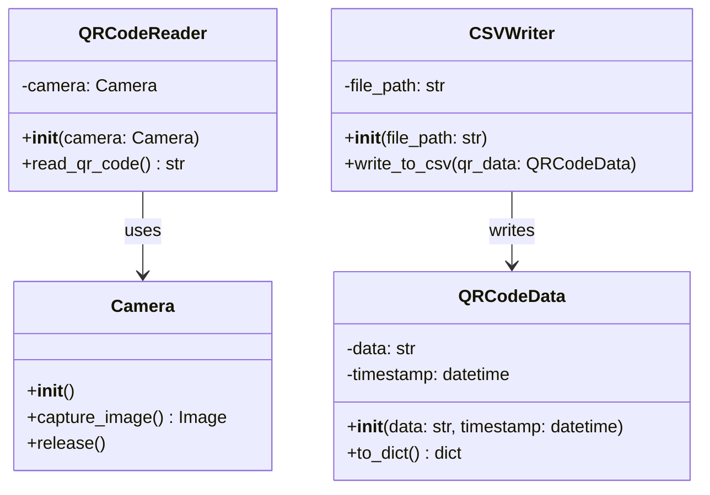

# QRコードアプリ

```mermaid
classDiagram
    class Camera {
        +__init__()
        +capture_image() Image
        +release()
    }

    class QRCodeReader {
        -camera: Camera
        +__init__(camera: Camera)
        +read_qr_code() str
    }

    class QRCodeData {
        -data: str
        -timestamp: datetime
        +__init__(data: str, timestamp: datetime)
        +to_dict() dict
    }

    class CSVWriter {
        -file_path: str
        +__init__(file_path: str)
        +write_to_csv(qr_data: QRCodeData)
    }

    QRCodeReader --> Camera : uses
    CSVWriter --> QRCodeData : writes
```
  